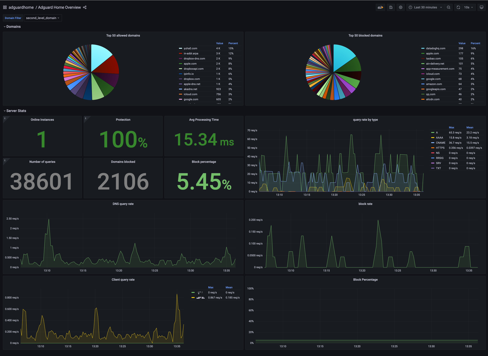

# AdGuard Home dashboards

`adguardhome.json` is developed based on the upstream dashboard example in https://github.com/ebrianne/adguard-exporter/tree/master/grafana.



## Modifications

The upstream version focus on metrics on each adguard home running instance and you can only view one instance at a time. That's not what I am interested in at all. Since I deploy AdGuard Home in HA mode with multiple replicas, it is more important to get aggregated metrics from all replicas and construct a global view of DNS query stats for the whole network. This modified version adds a `sum()` to all the panels.

The exporter's metrics has a label, `domain`, and basically every domain has a time series. This means for dashboards with `domain` has a legend filder, they will be filled by noisy subdomain values like:

```
17de4c0f.akstat.io
17de4c12.akstat.io
17de4c14.akstat.io
17de4c15.akstat.io
17de4c16.akstat.io
17de4c19.akstat.io
17de4c1d.akstat.io
```

The workaround is to [add a relabling rule to capture second level domains with a regex](../../../adguardhome/servicemonitor.yaml) in another label, `second_level_domain`. And there's a variable selection dropdown to switch between `domain` and `second_level_domain`. In this way, I can see query count for `*.akstat.io`.

Some raw counter dashboards are replaced with `rate()`. Because knowing how many DNS queries are block in the past 1 year in total is less useful than knowing the per second block ratio.

Finally, the dedicated table panels in upstream are not very useful to me and they occupy large screen real estate. This dashboard removes them and displays tabel legends in piechart panels.
